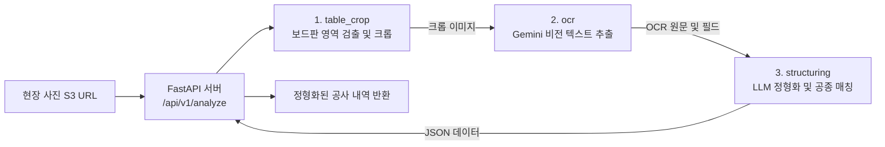

# 🏗️ 현장노트 AI (Field Note AI) - AI 백엔드 파이프라인

> 건설 현장 사진(공사 보드판)을 업로드하면 **보드판/작업 사진 영역 자동 분리**, **고정밀 OCR 전사**, **LLM 기반 공사 데이터 정형화 및 표준 공종 매칭**을 수행하는 AI 백엔드 시스템입니다.

---

## 📌 목차
1. [프로젝트 개요](#-1-프로젝트-개요)
2. [시스템 아키텍처 및 파이프라인](#-2-시스템-아키텍처-및-파이프라인)
3. [사전 요구사항 및 의존성](#-3-사전-요구사항-및-의존성)
4. [환경 설정 (Environment Setup)](#-4-환경-설정-environment-setup)
5. [서버 구동 방법 (Quick Start)](#-5-서버-구동-방법-quick-start)
6. [핵심 모듈 상세 설명](#-6-핵심-모듈-상세-설명)
7. [REST API 명세서](#-7-rest-api-명세서)
8. [주요 CLI 스크립트 가이드](#-8-주요-cli-스크립트-가이드)
9. [테스트 실행 (Testing)](#-9-테스트-실행-testing)
10. [디렉토리 구조 및 스크립트 관리 규칙](#-10-디렉토리-구조-및-스크립트-관리-규칙)

---

## 🎯 1. 프로젝트 개요

현장노트 AI의 AI 백엔드는 다음과 같은 핵심 문제를 해결합니다:
- **자동 영역 분리**: 현장 사진 속 공사 보드판(화이트보드/흑판)을 CV 알고리즘으로 자동 탐지하여 고해상도 작업 사진과 텍스트 영역을 분리.
- **무가공 원문 보존 OCR**: 보드판 텍스트(공사명, 공종, 위치, 작업내용, 일자 등)를 왜곡 없이 정밀 추출.
- **스마트 공사 데이터 구조화**: 비정형 텍스트(예: `벽체D65*2 양면 시공`)를 분석하여 규격(`65`), 수량(`2.0`), 위치, 일자로 정규화하고 표준 공종(WorkType)과 매칭.
- **REST API 서빙**: 웹 백엔드(Spring Boot / Node.js 등)와 연동 가능한 비동기 고성능 FastAPI 서버 제공.

---

## 🏗️ 2. 시스템 아키텍처 및 파이프라인



| 단계 | 모듈 | 기술 스택 | 핵심 역할 |
| :--- | :--- | :--- | :--- |
| **1단계** | `table_crop` | OpenCV, NumPy, Pillow | 화이트 마스킹, Canny 에지 검출, BBox 크롭 |
| **2단계** | `ocr` | Google GenAI SDK (Gemini Flash) | 멀티모달 비전 OCR 및 5대 핵심 항목 추출 |
| **3단계** | `structuring` | Google Gemini Flash | Few-shot 기반 정형화, 단위/규격 파싱, WorkType 매칭 |
| **4단계** | `server` | FastAPI, Uvicorn, Pydantic v2 | End-to-End 오케스트레이션 및 REST API 서빙 |

---

## 📦 3. 사전 요구사항 및 의존성

### 시스템 요구사항
- **Python**: 3.10 이상 (3.11, 3.12, 3.13 호환)
- **운영체제**: macOS / Linux (Ubuntu 20.04+ 권장) / Windows

### 주요 라이브러리
- **Web Framework**: `fastapi`, `uvicorn[standard]`
- **Data Validation**: `pydantic>=2.0`
- **Vision & Image**: `opencv-python-headless`, `numpy`, `Pillow`
- **AI / LLM**: `google-genai`
- **Networking & Async**: `httpx`, `python-dotenv`

### 의존성 설치
```bash
# 가상환경 생성 및 활성화
python3 -m venv .venv
source .venv/bin/activate  # Windows: .venv\Scripts\activate

# 패키지 설치
pip install -r requirements.txt
```

---

## ⚙️ 4. 환경 설정 (Environment Setup)

`ai/.env.example` 파일을 복사하여 `ai/.env` 파일을 생성하고 필요한 환경 변수를 설정합니다.

```bash
cp .env.example .env
```

### `.env` 주요 환경 변수 설정

```ini
# Google Gemini API Key (필수: https://aistudio.google.com/ 발급)
GEMINI_API_KEY=AIzaSy...your_actual_api_key_here

# 사용할 Gemini 모델 (기본값: gemini-3.5-flash-lite 또는 gemini-3.7-flash)
GEMINI_MODEL=gemini-3.7-flash

# AI 서버 구동 모드 ('integrated': 실제 AI 파이프라인 연동 / 'stub': 모의 테스트 모드)
AI_SERVER_MODE=integrated
```

> [!NOTE]
> `AI_SERVER_MODE=stub` 설정 시, 외부 API 호출 없이 개발/테스트용 Mock 데이터를 반환하므로 API 키 없이도 프론트엔드/백엔드 연동 테스트가 가능합니다.

---

## 🚀 5. 서버 구동 방법 (Quick Start)

### 스크립트를 통한 구동 (권장)
```bash
# 프로젝트 루트 또는 ai 디렉토리에서 실행
python -m ai.scripts.run_server --host 0.0.0.0 --port 8000 --reload
```

### Uvicorn 직접 실행
```bash
# ai 디렉토리 기준
uvicorn src.server.main:app --host 0.0.0.0 --port 8000 --reload
```

서버 구동 후 브라우저에서 대화형 API 문서를 확인할 수 있습니다:
- **Swagger UI**: [http://localhost:8000/docs](http://localhost:8000/docs)
- **ReDoc**: [http://localhost:8000/redoc](http://localhost:8000/redoc)

---

## 🧩 6. 핵심 모듈 상세 설명

### 1. `table_crop` (보드판 영역 검출 및 크롭)
- **경로**: `src/table_crop/`
- **기능**: 현장 사진에서 OpenCV 기반 컬러 마스킹 및 모폴로지 연산으로 보드판 표 영역을 고속 탐지하고 Bounding Box 단위로 크롭합니다.
- **주요 클래스**: `TableCropper`, `TableCropPipeline`, `FileImageLoader`, `FileImageSaver`

### 2. `ocr` (고정밀 보드판 비전 OCR)
- **경로**: `src/ocr/`
- **기능**: 크롭된 보드판 이미지에서 무가공 원문(Raw Text)을 전사하고 `공사명`, `공종`, `위치`, `내용`, `일자` 항목으로 1차 분리합니다.
- **주요 클래스**: `GeminiOCREngine`, `OCRPipeline`, `BoardTableItem`, `OCRResult`

### 3. `structuring` (공사 텍스트 정형화 & 표준 공종 분류)
- **경로**: `src/structuring/`
- **기능**: OCR 텍스트에서 위치(`location`), 일자(`workDate`), 품목 리스트(`items`)를 추출하고, 복합 규격/수량 파싱 및 표준 공종 ID(`matchedWorkTypeId`) 매칭을 수행합니다.
- **주요 클래스**: `GeminiStructuringEngine`, `StructuringService`, `LocalJsonWorkTypeRepository`

### 4. `server` (FastAPI 통합 서빙)
- **경로**: `src/server/`
- **기능**: S3 이미지 다운로드부터 크롭 ➔ OCR ➔ 구조화까지 전체 파이프라인을 비동기로 오케스트레이션하고 통일된 API 응답을 반환합니다.
- **주요 클래스**: `PipelineService`, `AnalyzeRequest`, `AnalyzeResponse`

---

## 🌐 7. REST API 명세서

### 1. 헬스체크 (`GET /api/v1/health`)
서버 가동 상태와 현재 구동 모드(`integrated` / `stub`)를 반환합니다.

#### Response (`200 OK`)
```json
{
  "status": "ok",
  "service": "fieldnote-ai-server",
  "mode": "integrated"
}
```

---

### 2. 현장 사진 분석 (`POST /api/v1/analyze`)
현장 사진 S3 URL과 표준 공종 목록을 수신하여 정형화된 공사 내역 데이터를 동기 반환합니다.

#### Request Body
```json
{
  "image_url": "https://fieldnote-bucket.s3.ap-northeast-2.amazonaws.com/photos/sample_board.jpg",
  "task_id": "task_20260826_001",
  "work_types": [
    { "id": 101, "name": "내화충전" },
    { "id": 102, "name": "덕트" },
    { "id": 103, "name": "금속관벽체" }
  ]
}
```

| 필드명 | 타입 | 필수 여부 | 설명 |
| :--- | :--- | :---: | :--- |
| `image_url` | `string` | **필수** | 분석할 현장 사진의 S3 접근 URL (Public / Presigned URL) |
| `task_id` | `string` | 선택 | 작업 식별자 ID (미입력 시 UUID 자동 생성) |
| `work_types` | `array` | 선택 | 공통 DB의 표준 공종 리스트 (`id`, `name`) |

#### Response Body (`200 OK`)
```json
{
  "success": true,
  "task_id": "task_20260826_001",
  "data": {
    "ocr_raw_text": "2024.06.28 / 101동 3층 / 벽체D65*2 양면 시공",
    "record": {
      "location": "101동 3층",
      "workDate": "2024-06-28",
      "items": [
        {
          "matchedWorkTypeId": 101,
          "spec": "65",
          "quantity": 2.0
        }
      ]
    }
  },
  "error": null,
  "execution_time_sec": 4.15
}
```

#### Error Response (`400 Bad Request` / `500 Internal Server Error`)
```json
{
  "success": false,
  "task_id": "task_20260826_001",
  "data": null,
  "error": {
    "code": "INVALID_IMAGE_URL",
    "message": "image_url은 http:// 또는 https:// 로 시작하는 유효한 URL이어야 합니다."
  },
  "execution_time_sec": 0.01
}
```

---

## 🛠️ 8. 주요 CLI 스크립트 가이드

각 모듈을 독립적으로 테스트하거나 배치 작업을 수행할 수 있는 CLI 스크립트가 제공됩니다.

### 1. 보드판 일괄 크롭 (`crop_tables.py`)
```bash
python ai/scripts/crop_tables.py -i sample_data/test_samples/photos/ -o sample_data/test_samples/tables/ --save-metadata
```

### 2. Gemini OCR 일괄 추출 (`run_ocr.py`)
```bash
python ai/scripts/run_ocr.py -i sample_data/test_samples/tables/ -o reports/ocr_output/
```

### 3. 공사 텍스트 정형화 및 공종 매칭 (`run_structuring.py`)
```bash
# 단일 텍스트 직접 입력 테스트
python ai/scripts/run_structuring.py --text "6번 벽체 보 20*2 100 50 양면" --location "101동 지하4층" --date "2024-06-28"
```

---

## 🧪 9. 테스트 실행 (Testing)

`pytest`를 활용하여 전체 단위 테스트를 일괄 실행할 수 있습니다.

```bash
# ai 디렉토리에서 테스트 실행
PYTHONPATH=.:src:.. pytest tests -v
```

### 테스트 구성
- `tests/test_table_cropper.py`: 이미지 크롭 알고리즘 및 좌표 추출 검증
- `tests/ocr/test_*.py`: OCR 엔진, 로더, 세이버 및 스키마 검증
- `tests/test_structuring.py`: LLM 구조화 엔진, 수량/규격 파싱 및 공종 매칭 검증
- `tests/test_server.py`, `tests/test_server_integrated.py`: REST API 엔드포인트 및 오케스트레이션 검증

---

## 📂 10. 디렉토리 구조 및 스크립트 관리 규칙

```
ai/
├── src/                     # 핵심 AI 비즈니스 로직
│   ├── table_crop/          # 보드판 영역 검출 및 크롭
│   ├── ocr/                 # Gemini 비전 OCR
│   ├── structuring/         # 공사 데이터 구조화 및 공종 매칭
│   └── server/              # FastAPI REST API 서버
├── scripts/                 # [Git 추적] 프로덕션 서비스 및 CLI 스크립트
│   ├── run_server.py        # 분석 서버 구동 스크립트
│   ├── crop_tables.py       # 보드판 크롭 CLI
│   ├── run_ocr.py           # OCR CLI
│   ├── run_structuring.py   # 정형화 CLI
│   └── experiments/         # [Git 제외] 모델 파인튜닝, 평가, 데이터 전처리 스크립트
├── tests/                   # 단위 및 통합 테스트 코드 (테스트 실행 파일 및 필수 fixture만 유지)
├── reports/                 # [Git 제외] 모델 성능 평가 결과, 오차 분석, 벤치마크 리포트 및 실행 결과
├── sample_data/             # 샘플 이미지 및 현장 기준 데이터
├── requirements.txt         # 패키지 의존성 목록
├── .env.example             # 환경 변수 템플릿
├── AGENTS.md                # AI 개발 지침서
└── README.md                # 본 문서
```

### ⚠️ 디렉토리 및 스크립트 작성 준수 규칙
- **`scripts/` (Git 관리)**: 서비스 배포, 서버 구동, 핵심 모듈 CLI 등 실제 프로덕션 및 CI/CD에 필요한 스크립트만 저장합니다.
- **`scripts/experiments/` (Git 제외)**: 파인튜닝(Fine-tuning), 체크포인트 평가, 데이터셋 전처리/중복제거, Colab 동기화 및 모니터링 스크립트는 반드시 `scripts/experiments/`에 배치합니다.
- **`tests/` (Git 관리)**: 순수 단위/통합 테스트 코드(`test_*.py`)와 테스트 구동에 필요한 최소한의 예시 Mock 데이터만 배치합니다. 성능 평가/벤치마크 결과물은 `reports/eval/`로 저장합니다.
